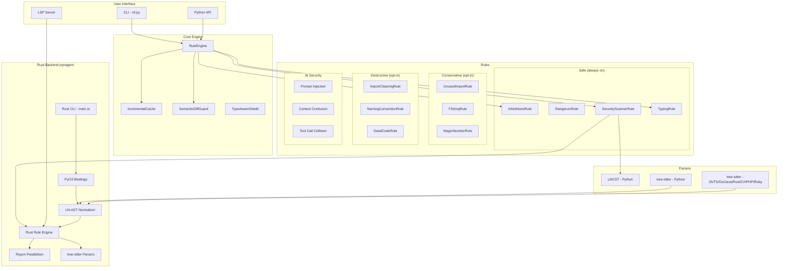
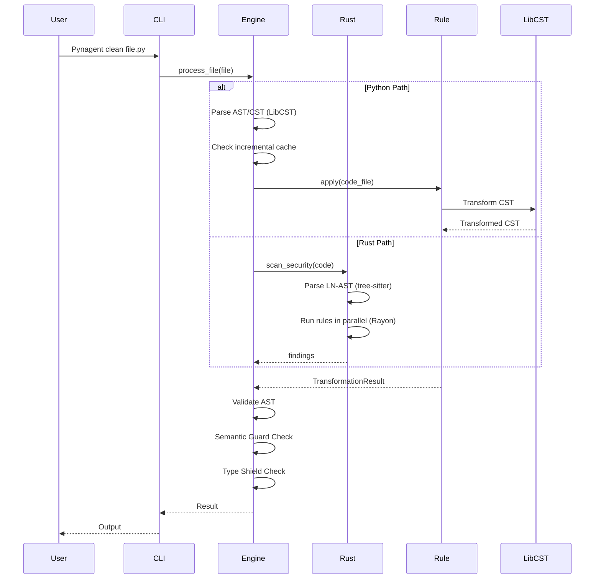
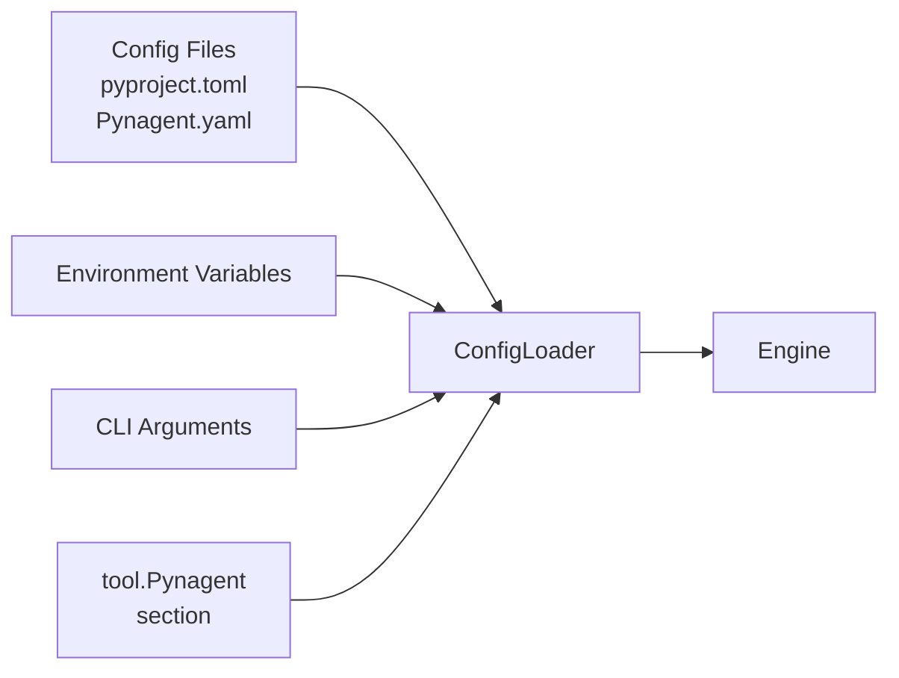

# Architecture

This document describes the architecture of Pynagent.

## Overview

Pynagent is an AI-Generated Code Scanner that detects and fixes common issues in AI-generated code. The architecture is designed to be modular, extensible, and performant.

## System Components



## Component Descriptions

### CLI (`Pynagent/cli.py`)

The command-line interface provides user-facing commands:

- `Pynagent clean <file>` - Clean a single file
- `Pynagent check <target>` - Security scan
- `Pynagent explain <rule_id>` - Explain a rule
- `Pynagent report <target>` - Generate report
- `Pynagent lsp` - Start LSP server

### RuleEngine (`Pynagent/core/engine.py`)

The core orchestration engine:

1. Parses source code using LibCST or tree-sitter (via Rust)
2. Runs rules in priority order (safe -> conservative -> destructive)
3. Validates output (AST compile check)
4. Detects conflicts between rules
5. Applies semantic guards and type shields

### Rules (`Pynagent/rules/`)

Each rule is a standalone class that:

1. Inherits from `Rule` base class
2. Implements `apply(CodeFile) -> TransformationResult`
3. Can read/write AST/CST nodes
4. Returns changes and security findings

### Rust Backend (`pynagent/`)

High-performance scanner written in Rust:

- **tree-sitter** for AST parsing across 9 languages
- **Rayon** for parallel rule evaluation
- **PyO3** for seamless Python bindings
- **LN-AST** normalizer for language-neutral code representation
- See [pynagent/README.md](../pynagent/README.md) for full details

## Data Flow



## Configuration System



## Extension Points

### Custom Rules

Create a custom rule by subclassing `Rule`:

```python
from Pynagent.rules.base import Rule
from Pynagent.core.types import CodeFile, TransformationResult, RuleConfig

class MyCustomRule(Rule):
    """Description of what this rule does."""

    def __init__(self, config: RuleConfig = None):
        super().__init__(config)

    @property
    def description(self) -> str:
        return "One-line description of the rule"

    def apply(self, code_file: CodeFile) -> TransformationResult:
        content = code_file.content
        transformed = self._transform(content)
        return self._create_result(code_file, transformed, ["Change description"])

    def _transform(self, content: str) -> str:
        # Transformation logic
        return content
```

### Plugins

Load plugins via entry points:

```toml
# pyproject.toml
[project.entry-points."Pynagent.plugins"]
my-plugin = "my_package:MyPlugin"
```

### Rule Registry

Register rules with package and priority:

```python
from Pynagent.rules.registry import RuleRegistry, register_rule

@RuleRegistry.register(package="safe", priority=10)
class MyRule(Rule):
    ...
```

## Performance Optimizations

1. **Incremental Cache**: AST/CST trees cached across RuleEngine instances
2. **Rule Priority**: Safe rules run first, destructive rules last
3. **Conflict Detection**: Skip conflicting rules automatically
4. **Semantic Guards**: Validate AST before/after transformations
5. **Rust Backend**: Parallel tree-sitter parsing and rule evaluation with Rayon
6. **LN-AST**: Language-neutral AST enables universal rule application

## Security Architecture

Security findings include:

- CWE/OWASP mapping
- CVSS scoring
- Fix guidance
- Auto-fix availability

```python
@dataclass(frozen=True)
class SecurityFinding:
    rule_id: str
    severity: str
    cwe_id: Optional[str]
    owasp_id: Optional[str]
    cvss_score: float
    auto_fix_available: bool
```
